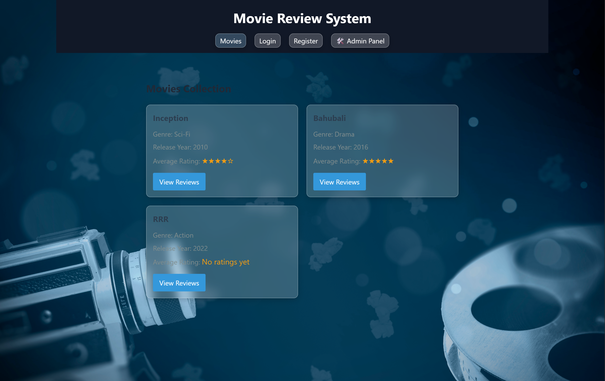
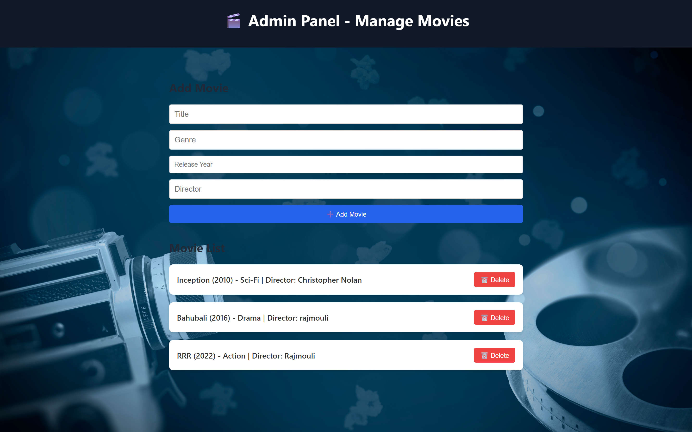

# 🎬 Movie Review System

A web-based movie review platform where users can view and review movies. Built using Node.js, Express, MySQL, and vanilla JavaScript.

## 🚀 Features

- 🔐 User registration & login (admin and user)
- 🎞️ View movies
- ⭐ Add & view reviews with star ratings
- 🛠️ Admin panel for adding/deleting movies

## 🖥️ Tech Stack

- Backend: Node.js, Express
- Frontend: HTML, CSS, JavaScript
- Database: MySQL

## 📸 Screenshots

### 🏠 Home Page


### 🛠️ Admin Panel


## 🛠️ How to Run Locally

```bash
git clone https://github.com/sharath25187/movie-review-system.git
cd movie-review-system
npm install
node app.js
